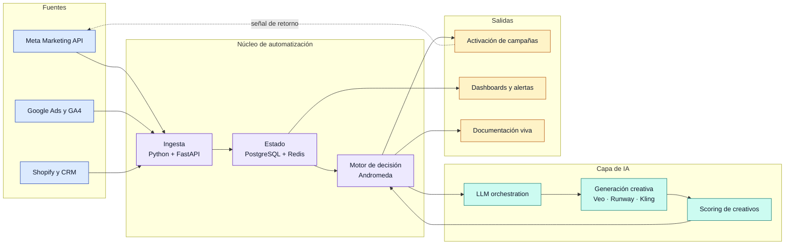
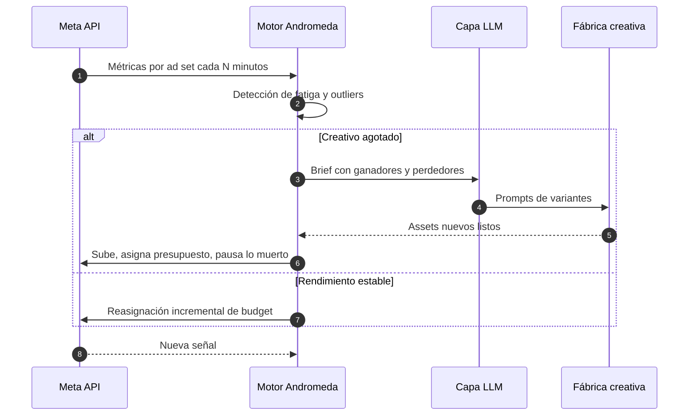

  

 

---

## 🧭 En una frase

Construyo **infraestructura de crecimiento**: pipelines que conectan adquisición pagada, generación creativa con IA y datos de producto en un solo sistema medible — no campañas sueltas ni scripts desechables.

> **Misión de largo plazo:** financiar programas de social-tech que enseñen ciencia e ingeniería a comunidades vulnerables en México.
> *La ingeniería es la herramienta. La educación es el resultado.*

| 🎯 Enfoque | 🏗️ Rol | ⚙️ Modo de trabajo |
|:---:|:---:|:---:|
| Growth systems y Meta Ads algorítmico | Arquitecto → implementador → operador | Reproducible, medible, modular |

---

## 📊 Impacto

<!-- ⚠️ REEMPLAZA estos números por los reales antes de publicar. -->

| Métrica | Resultado |
|:---|:---:|
| 💰 Ad spend gestionado con sistemas propios | **$XXX K USD** |
| 📉 Reducción de CPA en cuentas migradas a Andromeda | **-XX %** |
| 🎬 Creativos generados y testeados por mes vía pipeline IA | **XXX** |
| ⚡ Horas/mes de trabajo manual eliminadas | **XX h** |
| 🚀 Sistemas en producción mantenidos | **XX** |

---

## 🏗️ Cómo construyo — arquitectura de referencia

El bucle cerrado es el punto: cada activación devuelve señal que alimenta la decisión siguiente.

---

## 🔁 Andromeda — bucle de optimización

---

## 🚀 Trabajo seleccionado

<table>
<tr>
<td width="50%" valign="top">

### 🔥 Andromeda Ads Engine
`🟡 Beta · Privado`

**Problema.** La optimización manual de Meta Ads no escala: la fatiga creativa aparece más rápido de lo que un humano puede reaccionar.

**Solución.** Motor en Python que lee la Marketing API en ciclos cortos, detecta degradación por ad set, dispara generación de variantes vía LLM y video IA, y reasigna presupuesto automáticamente.

**Stack.** `Python` `Meta Marketing API` `Redis` `PostgreSQL`

[Demo →](https://xperta.social)

</td>
<td width="50%" valign="top">

### 📘 EF-Élite Playbook
`🟢 Activo`

**Problema.** El conocimiento de growth vive en cabezas y capturas de pantalla; no se transfiere ni se audita.

**Solución.** Playbook versionado y desplegado como documentación viva, con procesos reproducibles y criterios de decisión explícitos.

**Stack.** `Next.js` `Python` `PostgreSQL` `MkDocs`

[Docs →](https://xperta.social)

</td>
</tr>
<tr>
<td width="50%" valign="top">

### 🎨 Creative Matrix
`🟡 En desarrollo`

**Problema.** Producir y clasificar cientos de variantes creativas al mes sin perder trazabilidad de qué ángulo funcionó.

**Solución.** Matriz de ángulos × formatos × hooks con generación asistida por IA y scoring de rendimiento retroalimentado.

**Stack.** `React` `TypeScript` `AI APIs`

[Preview →](https://xperta.social)

</td>
<td width="50%" valign="top">

### ⚡ Career Velocity v2
`🟢 Activo`

**Problema.** Los perfiles técnicos se desactualizan y nadie los mantiene a mano.

**Solución.** Sistema de perfil y portafolio construido sobre CI/CD: el contenido se genera, valida y publica automáticamente.

**Stack.** `Markdown` `GitHub Actions` `Automation`

[Repo →](https://github.com/lbaddass/jluisgarciaorobio)

</td>
</tr>
</table>

---

## 🧰 Stack

<b>Ver stack completo</b>

 

**Lenguajes y frameworks**

  
  
  
  
  
  
  
  

**Cloud e infraestructura**

  
  
  
  
  
  
  

**IA y sistemas creativos**

  
  
  
  
  
  
  
  

**Growth, analytics y automatización**

  
  
  
  
  
  

**Datos**

  
  
  
  
  

**Creativo y media**

  
  
  

---

## 🧠 Principios de ingeniería

<table>
<tr>
<td width="33%" valign="top"><b>🔁 Reproducible</b> Si no se puede recrear desde cero con un comando, no es infraestructura: es suerte.</td>
<td width="33%" valign="top"><b>📏 Medible</b> Cada sistema define su métrica de éxito antes de la primera línea de código.</td>
<td width="33%" valign="top"><b>🧩 Modular</b> Piezas reemplazables. Ningún proveedor de IA o de ads es punto único de falla.</td>
</tr>
<tr>
<td valign="top"><b>📚 Documentado</b> La documentación es parte del entregable, no un extra posterior.</td>
<td valign="top"><b>⚙️ Automatizado por defecto</b> Lo que se hace tres veces a mano se convierte en pipeline.</td>
<td valign="top"><b>💵 Orientado a P&amp;L</b> El código que no mueve una métrica de negocio es un pasatiempo.</td>
</tr>
</table>

---

## 📈 GitHub

 

  

<!-- Requiere el workflow .github/workflows/snake.yml -->
<picture>
  <source media="(prefers-color-scheme: dark)" srcset="https://raw.githubusercontent.com/lbaddass/lbaddass/output/github-contribution-grid-snake-dark.svg" />
  <source media="(prefers-color-scheme: light)" srcset="https://raw.githubusercontent.com/lbaddass/lbaddass/output/github-contribution-grid-snake.svg" />
  
</picture>

---

## 🌱 Ahora mismo

- 🔭 Escalando **Andromeda** a multi-cuenta con presupuesto compartido
- 🧪 Evaluando modelos locales para bajar el costo de inferencia de la fábrica creativa
- ✍️ Escribiendo la versión pública del **EF-Élite Playbook**
- 🎓 Diseñando el currículum del programa social-tech en México
- 📚 Aprendiendo SOPs de Amazon con el equipo de Amazon ADS Internal como CM

---

## 🤝 Trabajemos juntos

Disponible para **arquitectura de sistemas de growth**, **automatización con IA** e **iniciativas de impacto social**.

| Recurso | Qué encontrarás |
|:---|:---|
| [xperta.social](https://www.xperta.social) | Sistemas de growth engineering y frameworks de automatización |
| [LinkedIn](https://www.linkedin.com/in/jlgarciaorobio/) | Red profesional y discusión técnica |
| [Growth Playbook](https://www.xperta.social) | Documentación pública de EF-Élite, Andromeda y pipelines de IA |
| [Stack Overflow](https://stackoverflow.com/users/28878221/luis) | Huella técnica y respuestas |

